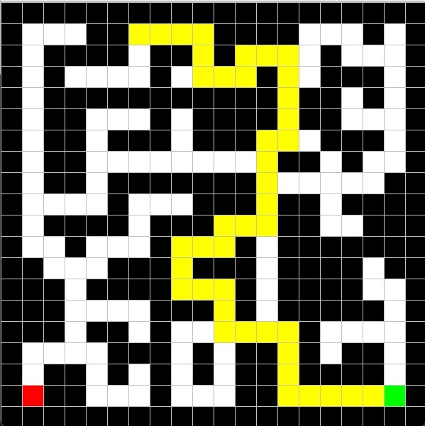
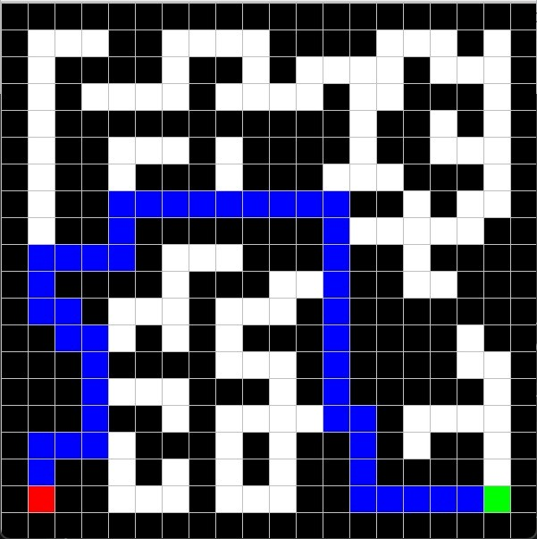

# Ex2 - Map & Pathfinder 📍

A simple GUI application for creating 2D maps and running pathfinding algorithms.

## 🏃 How to Run
Run the `Ex2_GUI` class located in `assignments.Ex2`.

## ⌨️ Controls
| Key | Function |
|---|---|
| **m** | Switch Mode (Draw / Solve) |
| **p, l, c, r** | Draw **P**oint, **L**ine, **C**ircle, **R**ectangle |
| **f** | Flood Fill (Bucket tool) |
| **s / e** | Set **Start** (Green) / **End** (Red) points |
| **0** | Run **Shortest Path** (Blue) |
| **Space** | Clear Map |
| **a / y** | Save / Load `map.txt` |

## 🧠 Algorithms
* **Shortest Path:** Uses BFS to find the optimal route avoiding obstacles.
* **Flood Fill:** Recursively fills connected pixels with a new color.

## 📸 Screenshots

--- ---

--- ---

